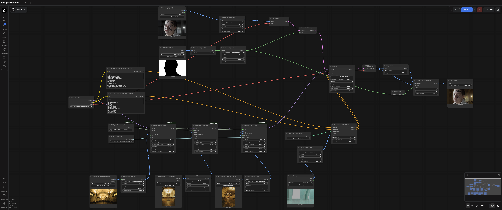
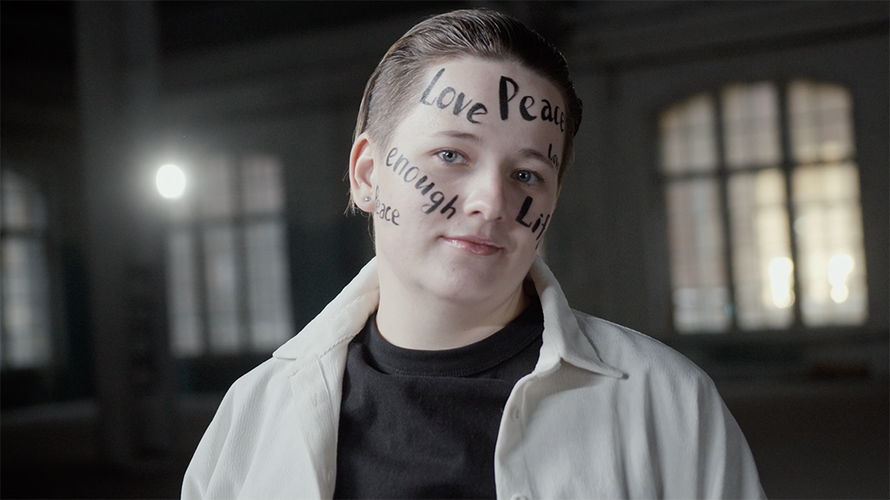
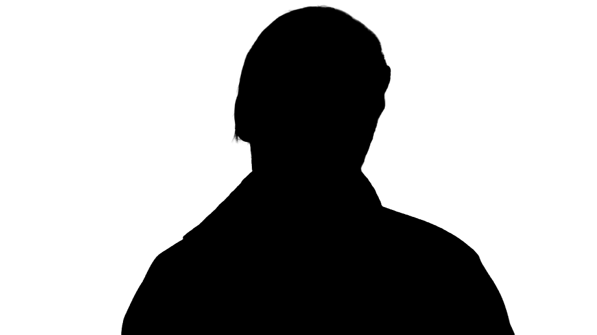
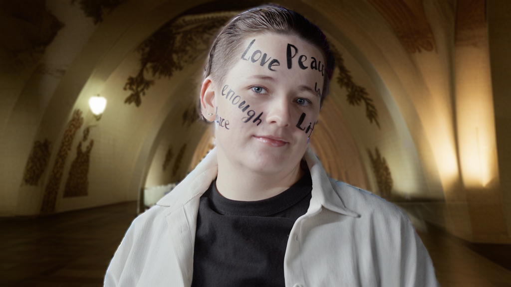

# ComfyUI Shot Consistency

Experiments exploring how to maintain visual consistency across multiple AI-generated shots.

Focus on camera continuity, background generation, and workflow design using ComfyUI and generative models.

These are fast prototyping experiments rather than polished outputs.

## What’s inside
- ComfyUI workflow files
- Sample inputs and outputs
- Notes on workflow design and iteration

## Current directions
- Background generation with shot-to-shot consistency
- Layout guidance using simplified depth references
- Actor/background compositing workflows
- Comparing model behaviour across different setups

## Tools & Workflow

- ComfyUI for node-based generation
- ControlNet (Depth) for layout guidance
- IPAdapter for reference-based consistency
- SDXL-based models for image generation

The focus of this project is on workflow design and iteration rather than specific model dependencies.

## Example Workflow

Below is a simplified ComfyUI workflow used in these experiments.

## Notes on Setup

This repository uses standard ComfyUI workflows with common extensions such as ControlNet and IPAdapter.

Exact models are not strictly required, as the focus is on workflow design rather than specific checkpoints.

## Example Input

## Example Output

## License

MIT License